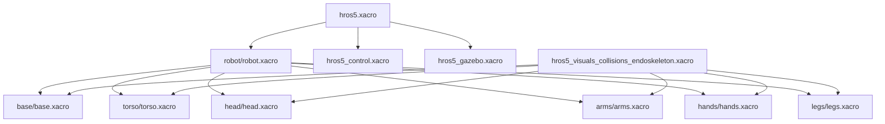

# hros5_description

This package contains the full HR-OS5 robot description used for RViz, Gazebo,
MoveIt2, and ros2_control. It provides:

- 🤖 Geometry and kinematics (URDF/Xacro)
- 🎨 Visual and collision meshes
- 🔧 ros2_control configuration (`hros5_control.xacro`)
- 🏗️ Gazebo configuration (`hros5_gazebo.xacro`)
- 👀 RViz visualization files

This is the authoritative definition of the robot's structure.

------------------------------------------------------------

## 📁 Directory Structure

```text
hros5_description/
├── CMakeLists.txt
├── launch
│   ├── display_arms.launch.py
│   ├── display_hands.launch.py
│   ├── display_hros5.launch.py
│   ├── display.launch.py
│   ├── display_left_hand.launch.py
│   └── test_dynamixel.launch.py
├── meshes
│   ├── arms/
│   │   ├── *.stl
│   │   └── *.dae
│   ├── hands/
│   │   ├── *.stl
│   │   └── *.dae
│   ├── head/
│   │   ├── *.stl
│   │   └── *.dae
│   ├── legs/
│   │   ├── *.stl
│   │   └── *.dae
│   └── torso/
│       ├── *.stl
│       └── *.dae
├── package.xml
├── rviz
│   ├── arms.rviz
│   ├── hros5.rviz
│   └── left_hand.rviz
├── src
│   └── hros5_description_node.cpp
└── urdf
    ├── arms/
    │   ├── arms.xacro
    │   └── arms_test.xacro
    ├── base/
    │   └── base.xacro
    ├── hands/
    │   ├── hands.xacro
    │   ├── hands_control.xacro
    │   ├── hands_test.xacro
    │   ├── left_hand.xacro
    │   └── left_hand_test.xacro
    ├── head/
    │   └── head.xacro
    ├── hros5_control.xacro
    ├── hros5_gazebo.xacro
    ├── hros5.urdf
    ├── hros5_visuals_collisions_endoskeleton.xacro
    ├── hros5.xacro
    ├── legs/
    │   └── legs.xacro
    ├── robot/
    │   └── robot.xacro
    ├── test_hand_control.urdf.xacro
    └── torso/
        └── torso.xacro
```

------------------------------------------------------------

## 🗺 Xacro Include Overview

This diagram shows how the major Xacro files depend on each other.
Arrows indicate "includes" or "depends on".



------------------------------------------------------------

## 🧩 Key Files

- `hros5.xacro`  
  Main entry point for the entire robot description.

- `robot/robot.xacro`  
  Includes the body-part modules (arms, legs, head, torso, base, hands).

- `hros5_control.xacro`  
  Declares ros2_control hardware interfaces.

- `hros5_gazebo.xacro`  
  Adds Gazebo-specific plugins and sensors.

- `hros5_visuals_collisions_endoskeleton.xacro`  
  Loads STL/DAE meshes for visuals and collisions.

------------------------------------------------------------

## 📌 Status

This package is actively maintained and evolving through phases P0–P2:

- Geometry: complete  
- Visuals/collisions: integrated  
- ros2_control: integrated  
- Gazebo: needs final inertia/physics tuning  
- Fully supported in RViz
